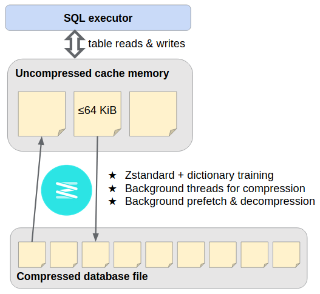

# Genomics Extension Internals

## Compression layer



SQLite's [file format](https://www.sqlite.org/fileformat.html) divides the database file into a number of fixed-size pages, and it makes I/O requests one page at a time. The [compression layer](https://github.com/mlin/sqlite_zstd_vfs) is a [VFS extension](https://www.sqlite.org/vfs.html) intermediating these requests, using [Zstandard](https://facebook.github.io/zstd/) to compress pages as they're written out and decompress as they're read back in. It uses background thread pools both to parallelize page compression and to "prefetch" during sequential scans.

The compressed pages must be stored in a file that can still be randomly accessed and updated, despite now being variable-length. To solve this, the compression layer uses an "outer" SQLite database, effectively nesting one database inside another. Where SQLite would write database page #P at offset P × page_size in the disk file, instead `INSERT INTO outer_page_table(rowid,data) VALUES(P,compressed_inner_page)`, and later `SELECT data FROM outer_page_table WHERE rowid=P`. Outer database transactions maintain ACID reliability (use at your own risk).

## Genomic Range Index


The GenomicSQLite GRI is a conventional multi-column B-tree index, organized so that feature overlap with any length distribution is detectable using a series of SQL "between tuples" queries. 

1. Partition the features into "levels" according to their length. Each level *L* for 0 &le; *L* &lt; 16 consists of all features with 16<sup>L-1</sup> &lt; length &le; 16<sup>L</sup>. (Level 0 has features of length 0 or 1.)
2. The GRI is a multi-column SQL index on each feature's: (chrom, level, position, length)
3. The features on level *L* overlapping a query range (qchrom, qpos, qend) are: ((chrom, level, position) BETWEEN (qchrom, *L*, qbeg - 16<sup>*L*</sup>) AND (qchrom, *L*, qend)) AND position+length &ge; qbeg.
    * <small>SQLite understands this query more-or-less as shown, and plans efficiently to (i) search the index B-tree for the first entry whose tuple (chrom, level, position) &ge; (qchrom, *L*, qbeg - 16<sup>*L*</sup>), (ii) scan while it's &le; (qchrom, *L*, qend), and (iii) apply the last filter.</small>
    * <small>We search higher levels over exponentially wider position ranges, but they only harbor features of comparable length.</small>
4. Union the disjoint results for *L* between 0 and 15.

We can optimize queries to "fan out" to fewer than 16 levels (which gratuitously admit lengths up to 2<sup>60</sup> nt) by first figuring out the lowest and highest level *actually occupied* by the indexed features (floor and ceiling). This can be learned during amortized query planning, using a few quick B-tree searches per chromosome in the existing index (`genomic_range_index_levels()`). Or, the caller can supply looser bounds based on lengthiest chromosome or other prior knowledge.

The fan-out is only 3 or 4 in many practical datasets. Sometimes it's inflated by a few outlier short features, which e.g. make the bottommost occupied level 0 or 1 instead of 2 or 3. In that case, we can simply push the short outliers up to a higher level &mdash; that's the `floor` argument to **Create Genomic Range Index SQL**.

One last detail: we negate the level number *L* in the B-tree index, so that when it's built up in genomic range order, smaller (typically more-numerous) features tend to insert into the *rightmost* leaf &mdash; that's usually faster than interior insertions.

This scheme combines the main ideas from [Ensembl's query based on maximum feature length](https://dx.doi.org/10.1093%2Fdatabase%2Fbax020) with the multi-level binning used in [UCSC Genome Browser](https://genome.cshlp.org/content/12/6/996.full), [BAI](https://dx.doi.org/10.1093%2Fbioinformatics%2Fbtp352), [tabix](https://doi.org/10.1093/bioinformatics/btq671), and [bedtools](https://dx.doi.org/10.1093%2Fbioinformatics%2Fbtq033). It addresses the former's sensitivity to outlier lengthy features. And it's simpler than the latter, without effective constraints on feature/chromosome length. A downside is that the index takes more space, storing four values per feature.

* <small>Feature length could be omitted from the B-tree index to save space at the cost of query speed. Including it lets our index query determine the exact result set without accessing the main table at all.</small>
* <small>chrom and level could be consolidated into one integer with some loss of flexibility. SQLite storage uses a variable-length integer encoding anyway.</small>

### Example query

Here's a GRI query on levels 0-2 using statement parameters (?1, ?2, ?3) = (queryChrom, queryBeg, queryEnd).

```sql
(SELECT _rowid_ FROM
 (SELECT _rowid_ FROM reads INDEXED BY reads__gri WHERE
   (reads._gri_rid,reads._gri_lvl,reads._gri_beg) BETWEEN
    ((?1),-2,(?2)-0x100) AND ((?1),-2,(?3)-0)
   AND (reads._gri_beg+reads._gri_len) >= (?2)
  UNION ALL
  SELECT _rowid_ FROM reads INDEXED BY reads__gri WHERE
   (reads._gri_rid,reads._gri_lvl,reads._gri_beg) BETWEEN
    ((?1),-1,(?2)-0x10) AND ((?1),-1,(?3)-0)
   AND (reads._gri_beg+reads._gri_len) >= (?2)
  UNION ALL
  SELECT _rowid_ FROM reads INDEXED BY reads__gri WHERE
   (reads._gri_rid,reads._gri_lvl,reads._gri_beg) BETWEEN
    ((?1),-0,(?2)-0x1) AND ((?1),-0,(?3)-0)
   AND (reads._gri_beg+reads._gri_len) >= (?2))
 ORDER BY _rowid_)
```

The `_gri_*` columns are [virtual generated columns](https://sqlite.org/gencol.html) added to the table based on the feature coordinate expressions specified during GRI creation.

The no-op subtraction of 0 from qend was found to be needed for SQLite to use the intended query plan in all cases. So too with the repetition of the length filter constraint, which looks like it should be factored out to the outer SELECT. 🤷

### Generating subquery SQL

The `genomic_range_rowids()` SQL function implementation just executes a query like the above and streams results back to the caller, taking care to minimize overhead by reusing prepared SQLite statements.

The extension also exposes the routine to generate the SQL subquery, which you can textually paste into your SQL in place of the `genomic_range_rowids()` invocation. This direct method is more efficient, given proper use of prepared statements, because everything compiles into one pure [SQLite bytecode program](https://www.sqlite.org/opcode.html), instead of context-switching into the extension for each result.

**↪ Genomic Range Rowids SQL**: *Generate a string* containing a parenthesized SELECT query on a GRI-indexed table, which *when executed* yields a rowid result set identifying the overlapping features. This is typically pasted as a subquery within a larger query that retrieves the result rows for further filtering/analysis.

=== "Python"
    ``` python3
    query = (
      'SELECT * FROM tableName WHERE tableName._rowid_ IN ' +
      genomicsqlite.genomic_range_rowids_sql(dbconn, 'tableName',
                                             # defaults:
                                             qrid='?1', qbeg='?2', qend='?3',
                                             ceiling=-1, floor=-1)
    )
    cursor = dbconn.execute(query, ('chr12',111803912,111804012))
    ```

=== "SQLiteCpp"
    ``` c++
    std::string GenomicRangeRowidsSQL(
      const std::string &indexed_table,
      sqlite3 *dbconn,
      const std::string &qrid = "?1",
      const std::string &qbeg = "?2",
      const std::string &qend = "?3",
      int ceiling = -1, int floor = -1
    );

    // SQLite::Database* dbconn
    std::string query = "SELECT * FROM tableName WHERE tableName._rowid_ IN "
      + GenomicRangeRowidsSQL("tableName", dbconn->getHandle());
    SQLite::Statement stmt(*dbconn, query);
    stmt.bindNoCopy(1, "chr12");
    stmt.bind(2, (sqlite3_int64) 111803912);
    stmt.bind(3, (sqlite3_int64) 111804012);
    while (stmt.executeStep()) {
      // process row
    }
    ```

=== "C++"
    ``` c++
    std::string GenomicRangeRowidsSQL(
      const std::string &indexed_table,
      sqlite3 *dbconn,
      const std::string &qrid = "?1",
      const std::string &qbeg = "?2",
      const std::string &qend = "?3",
      int ceiling = -1, int floor = -1
    );

    // sqlite3* dbconn
    std::string query = "SELECT * FROM tableName WHERE tableName._rowid_ IN "
      + GenomicRangeRowidsSQL("tableName", dbconn);

    // Omitted for brevity:
    // Compile query using sqlite3_prepare_v3()
    // Bind query range parameters using sqlite3_bind_{text,int64}()
    // Step through results as usual with sqlite3_step()
    ```

=== "C"
    ``` c
    char *genomic_range_rowids_sql(
      const char *indexed_table,
      sqlite3 *dbconn,
      const char *qrid,       /* null defaults to "?1" */
      const char *qbeg,       /* null defaults to "?2" */
      const char *qend,       /* null defaults to "?3" */
      int ceiling, int floor  /* set these to -1, not 0! */
    );

    /* sqlite3* dbconn */
    char* subquery = genomic_range_rowids_sql("tableName", dbconn, 0, 0, 0, -1, -1);
    if (*subquery) {
      /* Omitted for brevity:
       * Append subquery to "SELECT * FROM tableName WHERE tableName._rowid_ IN "
       * Compile query using sqlite3_prepare_v3()
       * Bind query range parameters using sqlite3_bind_{text,int64}()
       * Step through results as usual with sqlite3_step()
       */
    } else {
      /* see calling convention discussed in previous examples */
    }
    sqlite3_free(subquery);
    ```

Following the name of the indexed table *to be queried*, the routine takes three arguments supplying the desired range *to query it for* (queryChrom, queryBegin, queryEnd). These arguments default to `?1`, `?2`, and `?3`, sourcing the first three [bound parameters](https://www.sqlite.org/c3ref/bind_blob.html) of the top-level SQL query. They can be overridden to:

1. other numbered or named parameter placeholders
2. literal SQL values
3. names of columns in *other* tables being joined
4. simple expressions involving any of the above

**❗ The table name and expressions are textually pasted into a SQL template. Take care to prevent SQL injection, if they're in any way determined by external input.**

Unlike `genomic_range_rowids()`, the `genomic_range_rowids_sql` subquery generator defaults to level bounds auto-detected from the table at the time of subquery generation.

**❗ If the generated SQL query will be reused on a table that may have changed in the meantime, then ceiling & floor should be overidden based on the maximum and minimum possible feature length (ceiling=15 and floor=0 for full generality). **

If your language bindings don't include a wrapper for this routine, you can use the database connection to get the text result of `SELECT genomic_range_rowids_sql(tableName[, qrid, qbeg, qend[, ceiling, floor]])`.

